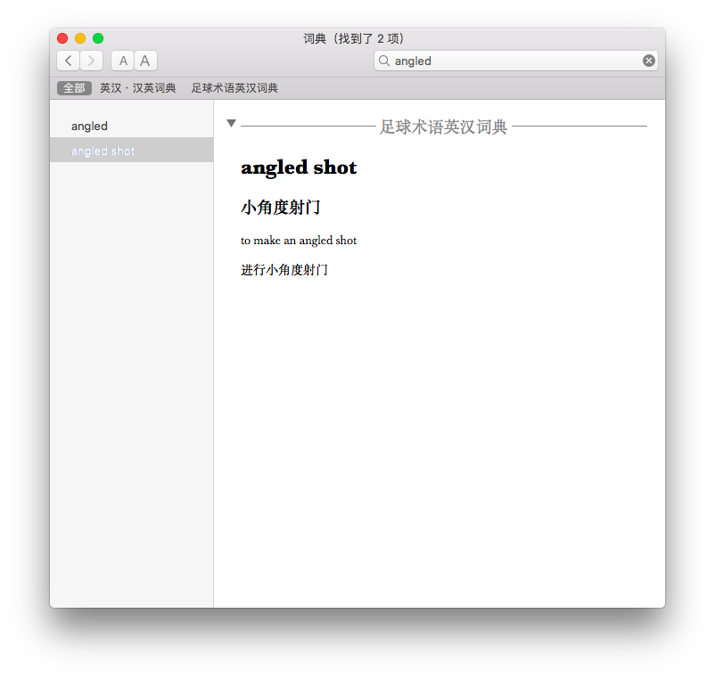

MacOS Dictionary.app 的足球术语英汉词典

## Installation

1. 打开 [https://developer.apple.com/](https://developer.apple.com/) 下载最新的 Additional Tools(需要开发者账号)，加载后把 Dictionary Development Kit 放入 <code>/Applications/Utilities/Dictionary Development Kit</code> (也可以放在其他位置，需要在 makefile 里修改相应变量)

2. 进入 football-dictionary-en_cn-macos 文件夹，执行 <code>make</code>, <code>make install</code>, <code>make clean</code>

3. 打开 Dictionary.app，在偏好设置里勾选 Football Terms Dictonary

## 编辑词典

1. 打开 csv 文件进行编辑。可以使用 Microsoft Excel 或 Google Sheets 导入编辑后再导出 csv。

2. 安装 Python 第三方依赖包 <code>pip install -r requirements.txt</code>

3. 进入 football-dictionary-en_cn-macos 文件夹执行 <code>python football_terms_dic.py</code>

4. 执行 Installation 步骤

## csv 格式规范

第一列为英文原词，第二列为中文释义，后面列均为例句，一句一列